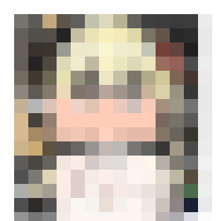
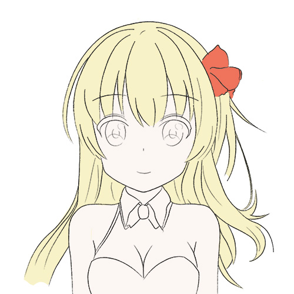
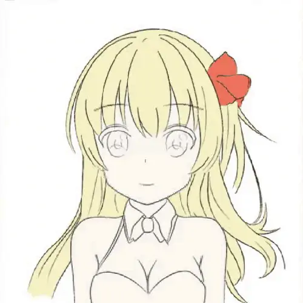

# 从零开始的自制Vtuber: 2.画图和绘图

在第二节里，我们将会使用一个PSD立绘，并用OpenGL将它画成动态的。

我们并不会使用Live2D，没错，这意味着我们接下来要做的就是发明一个Live2D。

此外，这一节并不会用到上一节的程序，所以如果你没有把上一节搞定也可以接着学习。

## 警告

这个章节还没有完成校订，因此可能有和谐内容。

请您收好鸡儿，文明观球。

## 准备

在这个章节，你需要准备: 

+ 电脑
+ Photoshop
+ 称手的画图工具
+ 基本的图形学知识
+ 基本的线性代数知识
+ Python3
+ psd-tools
+ NumPy
+ OpenCV
+ OpenGL


## 画画

要让Vtuber好看，最根本的方法是把立绘画得好看一些。  
如果你没办法画得好看，可能是色图看得少了，平时一定要多看萝莉图片！

首先，我们用称手的画图工具画一个女孩子，然后转换为PSD格式。


画出来大概是这样<sub>衣服涂不动了不涂了</sub>。  

注意要把你的图层分好，大概的原则是如果你觉得这个物件是会动的，就把它分一个图层。  
也可以参考我上面这个图层分法，总之图层拆得越细，动起来就越真实。

如果你不会画画，也可以找你的画师朋友帮忙。   
如果你不会画画而且没有朋友，那就用手随便画几个正方形三角形之类，假装是机器人Vtuber。


## 读取PSD

我们用psd-tools来把PSD文件读进Python程序里。

我习惯用先序遍历把图层全部拆散，如果你觉得这样不合适也可以搞点visitor模式之类的。  
我还顺便交换了值和图层的顺序，如果你不习惯就自己把它们删掉……

根据psd-tool的遍历顺序，先遍历到的子树对应的图层总是在后遍历到的子树的图层的下层，所以它必定是有序的。

```python
def 提取图层(psd):
    所有图层 = []
    def dfs(图层, path=''):
        if 图层.is_group():
            for i in 图层:
                dfs(i, path + 图层.name + '/')
        else:
            a, b, c, d = 图层.bbox
            npdata = 图层.numpy()
            npdata[:, :, 0], npdata[:, :, 2] = npdata[:, :, 2].copy(), npdata[:, :, 0].copy()
            所有图层.append({'名字': path + 图层.name, '位置': (b, a, d, c), 'npdata': npdata})
    for 图层 in psd:
        dfs(图层)
    return 所有图层
```

接下来，你可以试着用OpenCV把这些图层组合回来，检查一下有没有问题。

检查的方法很简单，只要按顺序写入图层，把它们都叠在对应的位置上就好了。

```python
def 测试图层叠加(所有图层):
    img = np.ones([500, 500, 4], dtype=np.float32)
    for 图层数据 in 所有图层:
        a, b, c, d = 图层数据['位置']
        新图层 = 图层数据['npdata']
        img[a:c, b:d] = 新图层
    cv2.imshow('', img)
    cv2.waitKey()
```

如果你真的这么干的话就会出现可怕的场景——因为真的很可怕，所以我先打上马赛克……如果你不害怕的话可以自己做一个。



这样叠起来实际上是不行的。  
这是因为最后一个通道表示的是图层的透明度，应该由它来决定前面的颜色通道如何混合。因此我们得把叠加的语句稍作修改。

你可以想象一下，如果要叠上来的图层比较透明，那它对原本的颜色的影响就比较小，反之就比较大。  
实际上，我们只要以`(1-alpha, alpha)`对新旧图层取一个加权平均数，就可以得到正确的结果——

```python
alpha = 新图层[:, :, 3]
for i in range(3):
    img[a:c, b:d, i] = img[a:c, b:d, i] * (1 - alpha) + 新图层[:, :, i] * alpha
```



看起来和Photoshop里的效果一模一样！  
修改之后，我们可以确认我们成功读入了图像。


## 使用OpenGL绘图

虽然我们刚才已经随便用OpenCV把它画出来了，但是为了接下来要做一些骚操作，我们还是得用OpenGL绘图。

OpenGL中的座标是四维座标`(x, y, z, w)`，在这里我们将`(x, y)`用作屏幕座标，`z`用作深度座标。  

因为这张立绘的大小是`1000px*1000px`，而OpenGL的平面范围是`(-1, 1)`，此外XY轴和我的设定还是相反的。  
所以我们先把立绘中每个图层的位置向量乘上变换矩阵，让它们到对应的位置去。

出于易读性考虑，我就用旧版OpenGL API来绘图吧，如果你能自己把它改为新版API的话就更好了。

```python
glPolygonMode(GL_FRONT_AND_BACK, GL_LINE)
for 图层数据 in 所有图层:
    a, b, c, d = 图层数据['位置']
    p1 = np.array([a, b, 0, 1])
    p2 = np.array([a, d, 0, 1])
    p3 = np.array([c, d, 0, 1])
    p4 = np.array([c, b, 0, 1])
    model = matrix.scale(2 / psd尺寸[0], 2 / psd尺寸[1], 1) @ \
            matrix.translate(-1, -1, 0) @ \
            matrix.rotate_ax(-math.pi/2, axis=(0,1))
    glBegin(GL_QUADS)
    for p in [p1, p2, p3, p4]:
        p = p @ model
        glVertex4f(*p)
    glEnd()
```


看起来很像机器人！
不过图中有五官的轮廓，右上角也有头饰的轮廓，我们姑且还能认出这个莉沫酱的框架是没问题的。

对了，上面的`matrix`是我随手写的一个变换矩阵库，我会把它放在这个项目代码库里。  
如果你的线性代数学得很好，应该可以自己把它写出来，因为它确实很简单，比如缩放矩阵`matrix.scale`只是这样定义的——

```python
def scale(x, y, z):
    a = np.eye(4, dtype=np.float32)
    a[0, 0] = x
    a[1, 1] = y
    a[2, 2] = z
    return a
```

接下来我们要为莉沫酱框架贴上纹理。

首先，我们启用OpenGL的纹理和混合功能，然后把每个图层都绑定好对应的纹理。

```python
glEnable(GL_TEXTURE_2D)
glEnable(GL_BLEND)
glBlendFunc(GL_SRC_ALPHA, GL_ONE_MINUS_SRC_ALPHA)
for 图层数据 in 所有图层:
    纹理编号 = glGenTextures(1)
    glBindTexture(GL_TEXTURE_2D, 纹理编号)
    纹理 = cv2.resize(图层数据['npdata'], (512,512))
    width, height = 纹理.shape[:2]
    glTexImage2D(GL_TEXTURE_2D, 0, GL_RGBA, width, height, 0, GL_BGRA, GL_FLOAT, 纹理)
    glTexParameteri(GL_TEXTURE_2D, GL_TEXTURE_MIN_FILTER, GL_LINEAR_MIPMAP_LINEAR)
    glGenerateMipmap(GL_TEXTURE_2D)
    图层数据['纹理编号'] = 纹理编号
```

然后在绘制每个图层的时候，将纹理绑定到对应的纹理编号上，这个步骤就算是完成了。

最后OpenGL窗口中的图像看起来应该像是这样——


你会发现这张图有点模糊<sub>(尤其是眉毛)</sub>，而且似乎有细小的裂痕。这是正常的，我们以后再来解决这个问题。


## 进入3D

终于到了最后让Vtuber动起来的步骤了。

为了让人物动起来有3D的感觉，我们首先得为各个图层指定深度。  
我建立了一个YAML文档，把每个图层的深度都写进去了，如果你不喜欢YAML也可以随便写个JSON代替。

我把各个图层的深度设置在1附近，越靠近观众的位置数值越小。

在解包PSD之后从YAML读取各个图层的数据，加入深度。  

```python
def 添加深度信息(所有图层):
    with open('深度.yaml', encoding='utf8') as f:
        深度信息 = yaml.load(f)
    for 图层信息 in 所有图层:
        if 图层信息['名字'] in 深度信息:
            图层信息['深度'] = 深度信息[图层信息['名字']]
```

然后要乘上一个透视矩阵，让画面呈现出3D感。不过在这之前我们得先来说一点座标变换的理论——

在一个2D的画面中我们观察角色使用的是平行投影，也就是无论我们把镜头拉近拉远，看到的图像只有整体的大小差别而已。  
但它也可以理解为在固定深度下的垂直的透视投影。从透视的角度来想，加入了Z座标以后，即使我们现在什么都不做，也会发生近大远小的现象，观察到的图层大小发生变化并不符合我们的预期。如果你直接乘上一个透视投影矩阵的话，大小就会全部错乱。

所以我们先做一个还原操作，把远处的图层放大，越远放得越大，这样一来图层乘上透视投影矩阵以后就会刚好变成和原来一样大。

```python
a[0] *= a[2]
a[1] *= a[2]
a = a @ matrix.perspective(999)
```

这个时候如果你重新使用OpenGL绘图，窗口内容应该看起来没有任何变化。

接下来，我们找出所有需要动的图层的座标，把它们再乘上一个绕轴旋转矩阵的话——

```python
a = a @ \
    matrix.translate(0, 0, -1) @ \
    matrix.rotate_ax(横旋转量, axis=(0, 2)) @ \
    matrix.rotate_ax(竖旋转量, axis=(2, 1)) @ \
    matrix.translate(0, 0, 1)
```



莉沫酱动起来了！

这一节就到此为止了……莉沫酱动得很粗糙，摇头的角度大一点就露馅了，之后的章节里我们得好好考虑怎么把她强化一下。

下一节我们来研究一下软件结构，好把会动的莉沫酱和面部捕捉结合起来。

## 结束

如果我的某些操作让你非常迷惑，你也可以去这个项目的GitHub仓库查看源代码。  
莉沫酱立绘的PSD也一起放在仓库里了，如果你画不出画的话可以用上。  
<sub>不过要注意莉沫酱立绘并不在开源许可的范围内，所以不要用来做其他的事情。</sub>

最后祝各位鸡儿放假。

下一节: 
+ [从零开始的自制Vtuber: 3.合成进化](3.md)
