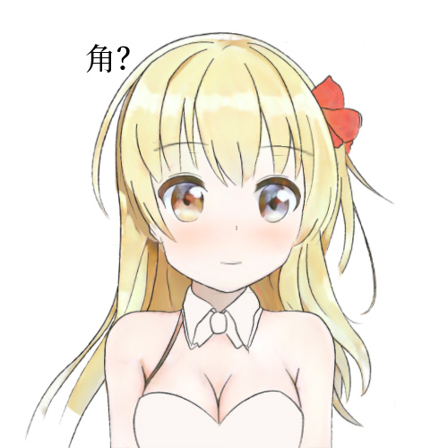
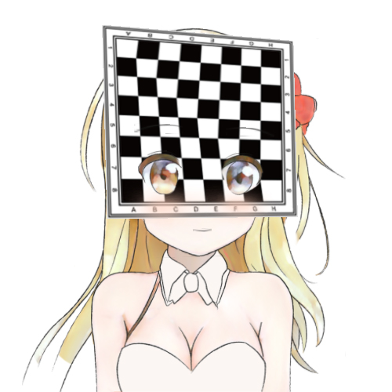
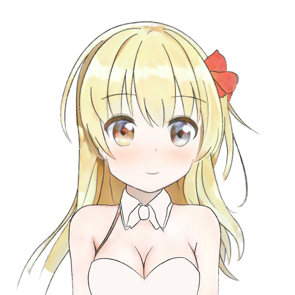
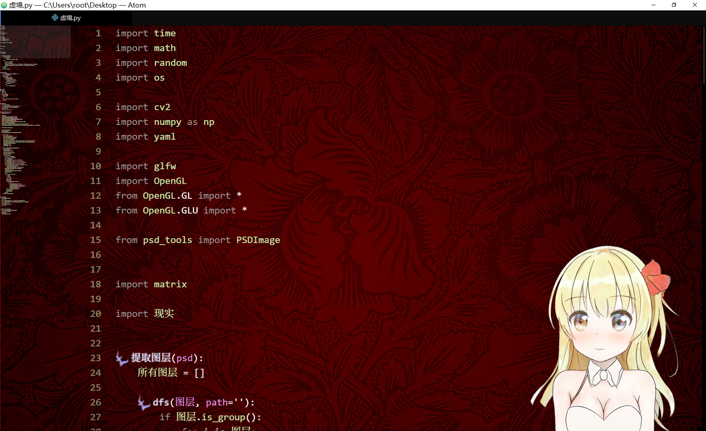

# 从零开始的自制Vtuber: 3.合成进化

这一节之所以叫「接触融合」是因为……怎么说呢，一要动手写教程，脑子里就会突然跳出来一些名字，心里想着「就是它了」，之后想要换个正规的名字又不舍得……

这个章节并不会让你把神经模式转移到Vtuber的身体里——在第二节里，我们已经做出了可以左摇右晃的立绘，现在是时候把脸部捕捉和动态立绘结合了。此外，我们还要处理一些图形学的细枝末节，让Vtuber进化得更漂亮一些，以及顺便让Vtuber显示在你的桌面上。


## 警告

这个章节还没有完成校订，因此可能有和谐内容。

请您收好鸡儿，文明观球。


## 准备

在这个章节，你需要准备: 

+ 电脑
+ 前面两节的代码
+ 简单的线程知识
+ 更多的图形学知识
+ Python3
+ NumPy
+ OpenGL


## 分离线程

之所以要这么做是因为面部捕捉的帧率和绘图的帧率并不相同，因此它们不能同步。

拆分出线程也方便我们做其他的修改。

首先我们把面部捕捉和Vtuber绘图拆为两个文件，随便起名叫`现实`和`虚境`好了。

接下来把面部捕捉循环提取到函数里，然后用一个副线程来运行它。  
因为从直觉来看没有数据错误的问题，所以这里我们不用加锁。

```python
特征组 = [0, 0]
def 捕捉循环():
    global 原点特征组
    global 特征组
    原点特征组 = 提取图片特征(cv2.imread('../res/std_face.jpg'))
    特征组 = 原点特征组 - 原点特征组
    cap = cv2.VideoCapture(0)
    while True:
        ret, img = cap.read()
        新特征组 = 提取图片特征(img)
        if 新特征组 is not None:
            特征组 = 新特征组 - 原点特征组
        time.sleep(1 / 60)
t = threading.Thread(target=捕捉循环)
t.setDaemon(True)
t.start()
```

我留了一个全局变量和一个接口以便通信。

在绘图代码里，每次绘图之前调用`现实.获取特征组()`获取各个角度，就可以绘图了。


### 添加缓冲

这个缓冲不是电脑的缓冲而是真的缓冲……

也许你已经发现了，我们进行了多线程改造以后绘图画面还是很卡，它甚至更卡了。  
这是因为我们的绘图信息完全取决于面部捕捉，如果它不回报新的信息，下一帧画出的图就和上一帧是完全一样的。

因此我们对特征做一个缓冲，让它像是SAI和Photoshop里的平滑画笔一样有一个逐渐改变的过程。  
当Vtuber的头要转到某个位置时，我们并不让头直接过去，而是让我们原本的旋转量快速趋向目标的旋转量。

```python
def 特征缓冲():
    global 缓冲特征
    缓冲比例 = 0.8
    新特征 = 现实.获取特征组()
    缓冲特征 = 缓冲特征 * 缓冲比例 + 新特征 * (1 - 缓冲比例)
    return 缓冲特征
```

这样一来，画面立刻变得流畅了不少。

对了，以前物述有栖就有这个问题，看来他们的程序员比较SB。

现在我们动起来像是这样——

  
<sub>(色素不够了，可能是最近可乐喝少了)</sub>

稳定而且流畅！  
看来我们的技术已经超过物述有栖了<sub>(雾)</sub>。

## 深度渐变

前几节的莉沫酱虽然会摇头摆尾(?)，但是动作还是很有纸片感。

出现这个问题，一个很重要的原因就是每个图层的深度都是确定的，因此角色看起来像是立体绘本，呃，就是机关书，你们小时候说不定见过这东西？

总之我们先把图层改成四个顶点可以使用不同深度的吧，做了这个操作以后Vtuber就会比较逼真了。  
当然你不嫌麻烦的话也可以用类似的方法自己整一个深度网格或者深度贴图。

先把读取深度信息的数据类型改掉: 

```python
if type(z) in [int, float]:
    图层信息['深度'] = [z, z, z, z]
elif isinstance(z, list):
    图层信息['深度'] = z
else:
    raise Exception('???')
```

然后在给OpenGL指定时使用不同的深度就行了——

```python
z1,z2,z3,z4 = 图层数据['深度']
p1 = np.array([a, b, z1, 1])
p2 = np.array([a, d, z2, 1])
p3 = np.array([c, d, z3, 1])
p4 = np.array([c, b, z4, 1])
```

我们把莉沫酱的前发的上测的深度加大一点，就加0.1好了，然后我们转到一个偏大的侧面角度观察——



<sub>(欸我后面一层忘记上色了)</sub>

似乎有成效了，但是这个头发是不是怪怪的？好像有一个尖尖角？

这个角在前发的左上方，就是我标了「角」字的右边，有一个导数不连续的点……如果你自己找到了说明你的视力很好。

为了解释这个问题，我们试着在头发前面贴上一层国际象棋——现在莉沫酱看起来很像怪盗<sub>(并不)</sub>。 

沿着棋盘的左上到右下的对角线观察，是不是可以看到空间好像被扭曲了？



其实我们的空间变换并没有出问题，你可以验证一下无论变换前后四个顶点都在同一个平面上。  
真正被扭曲的是那张贴图。

这是因为我们的图层不是矩形而是梯形。  
你可能会觉得奇怪「明明就是矩形啊」，但问题出在我们在第二节做了一个骚操作——

> 所以我们先做一个还原操作，把远处的图层放大，越远放得越大，这样一来图层乘上透视投影矩阵以后就会刚好变成和原来一样大。  
> a[0] *= a[2]  
> a[1] *= a[2]  
> a = a @ matrix.perspective(999)  

这么一搞以后如果上面的边的深度更大，四个顶点乘上不同的放大倍数，矩形就成了梯形！而矩形的纹理在贴上梯形之前会先被三角剖分，梯形贴上两个三角形变成了不对称的，于是它们就错位了。

解决办法是使用`glTexCoord4f`和4维纹理座标——

```
p1 = np.array([a, b, z1, 1,  0, 0, 0, z1])
p2 = np.array([a, d, z2, 1,  z2, 0, 0, z2])
p3 = np.array([c, d, z3, 1,  z3, z3, 0, z3])
p4 = np.array([c, b, z4, 1,  0, z4, 0, z4])
```

前4个数是空间座标，后4个数是纹理座标，纹理座标的最后一维相当于空间座标的`w`维度。  
它的原理并不太复杂，不过这个部分好像已经太长了，所以我相信你看到`w`维度就已经猜到它的原理了。

做了这个修理之后你可以用网格图再测试一下它的扭曲是不是消失了，然后我们重新渲染——


角没有了！

这样一来，带有倾斜图层的莉沫酱终于渲染好了。


## 优化纹理

之前我们还提到过一个画面看上去有点模糊的问题。这是因为OpenGL要求纹理是正方形，而且边长是2的整数次幂，而当时我们为了图省事把所有的纹理都缩放到了`512px*512px`。

就是这个地方——

```python
纹理 = cv2.resize(图层数据['npdata'], (512, 512))
```

这回我们不在这里用缩放了，而是生成一个比原图层大一点的纹理，然后把原图层丢进去，这样就可以避免一次缩放。

```python
def 生成纹理(img):
    w, h = img.shape[:2]
    d = 2**int(max(math.log2(w), math.log2(h))+1)
    纹理 = np.zeros([d,d,4], dtype=img.dtype)
    纹理[:w,:h] = img
    return 纹理, (w/d, h/d)
```

额外返回的是座标，把它们在设置纹理座标的时候乘上对应的z就行了。



升级之后莉沫酱看起来更清晰了。


## 融合之门

现在差不多是时候让莉沫酱像真正的Vtuber一样在桌面上动了！  
<sub>(怎么听起来有点色情……)</sub>

总之我们要把OpenGL的底色设为透明，然后给窗口设置一些透明啊、悬浮在最上层啊之类的标记，最后放到屏幕的右下角就行了。

```python
Vtuber大小 = 500, 500
glfw.init()
glfw.window_hint(glfw.RESIZABLE, False)
glfw.window_hint(glfw.DECORATED, False)
glfw.window_hint(glfw.TRANSPARENT_FRAMEBUFFER, True)
glfw.window_hint(glfw.FLOATING, True)
window = glfw.create_window(*Vtuber大小, 'Vtuber', None, None)
glfw.make_context_current(window)
monitor_size = glfw.get_video_mode(glfw.get_primary_monitor()).size
glfw.set_window_pos(window, monitor_size.width - Vtuber大小[0], monitor_size.height - Vtuber大小[1])
```

以及`glClearColor(0, 0, 0, 0)`。

你可以自己去看库的文档，或者直接复制我的代码也行。



莉沫酱真是太棒了！  
还有以后录个屏就可以直播了！


## 结束

如果我的某些操作让你非常迷惑，你也可以去这个项目的GitHub仓库查看源代码。

最后祝各位妻妾成群。

下一节: 
+ 我先休息两天再写
