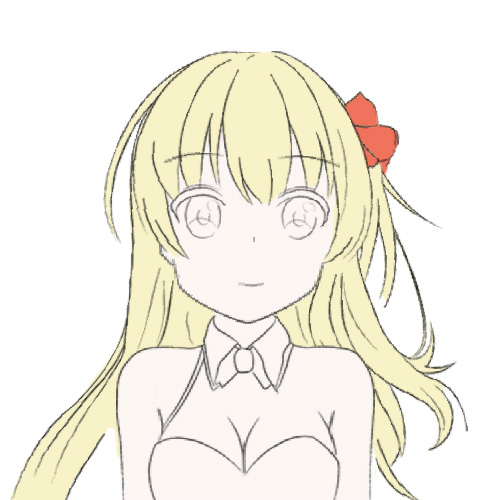
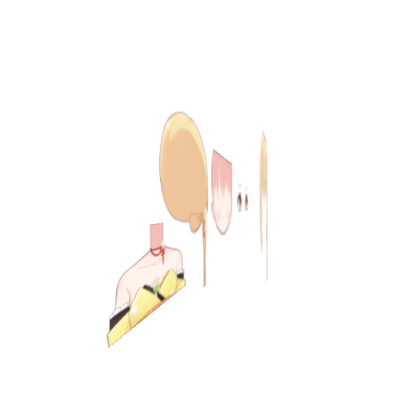
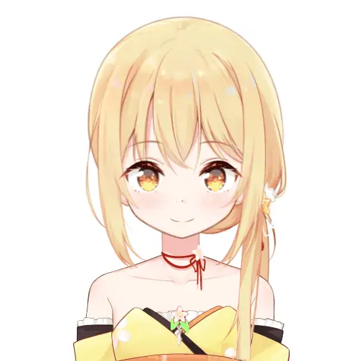
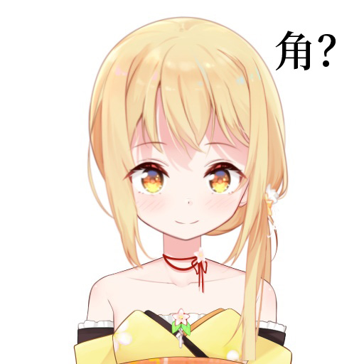
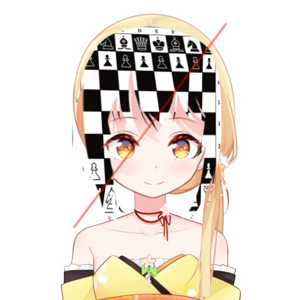

# 从零开始的自制Vtuber: 3.进入虚空

在这一节里，我们惟一要做的就是用OpenGL将我们的立绘画成立体的、动态的。

我们并不会使用Live2D，没错，这意味着我们接下来要做的就是发明一个Live2D。

这一节的代码非常少，但是需要你有比较好的图形学基础知识，所以理解起来可能有些困难。

## 警告

这个章节还没有完成校订，因此可能有和谐内容。

请您收好鸡儿，文明观球。

## 准备

在这个章节，你需要准备: 

+ 电脑
+ 基本的图形学知识
+ 基本的线性代数知识
+ Python3
+ NumPy
+ OpenGL

## 进入3D

终于到了让Vtuber动起来的步骤了。

为了让人物动起来有3D的感觉，我们首先得为各个图层指定深度。  
我建立了一个YAML文档，把每个图层的深度都写进去了，如果你不喜欢YAML也可以随便写个JSON代替。

它看起来是这样: 

```yaml
身体:
    0.9
脸:
    0.7
前发:
    0.6
...
```

我把各个图层的深度设置在1附近，越靠近观众的位置数值越小。

在解包PSD之后从YAML读取各个图层的数据，加入深度。  

```python
def 添加深度信息(所有图层):
    with open('深度.yaml', encoding='utf8') as f:
        深度信息 = yaml.load(f)
    for 图层信息 in 所有图层:
        if 图层信息['名字'] in 深度信息:
            图层信息['深度'] = 深度信息[图层信息['名字']]
```

有了深度信息我们只需要乘上一个透视矩阵，就能让画面呈现出3D感。

不过在这之前我们得先来说一点座标变换的理论——

我们知道，3D感来自于透视投影，也就是把一个锥形内的3D物件拍平，压到平面上出现的近大远小的效果。

在一个2D的画面中我们观察角色使用的是平行投影，也就是无论我们把镜头拉近拉远，看到的图像只有整体的大小差别而已。  
但它也可以理解为在固定深度下的垂直的透视投影。从透视的角度来想，加入了Z座标以后，即使我们现在什么都不做，也会发生近大远小的现象，观察到的图层大小发生变化并不符合我们的预期。

因此，我们把z座标先附到图层上——

```python
z = 图层数据['深度']
p1 = np.array([a, b, z, 1, 0, 0])
p2 = np.array([a, d, z, 1, w, 0])
p3 = np.array([c, d, z, 1, w, q])
p4 = np.array([c, b, z, 1, 0, q])
```

这个时候，如果你直接乘上一个透视投影矩阵的话，大小就会错乱，像是这样——

<sub>(这几张图片看起来都比较辣眼睛，因此我把它们藏在了details里面)</sub>

<details>



</details>

所以我们先做一个还原操作，把远处的图层放大，越远放得越大，这样一来图层乘上透视投影矩阵以后就会刚好变成和原来一样大。

```python
a[0:2] *= a[2]
a = a @ matrix.perspective(999)
```

这个时候如果你重新使用OpenGL绘图，窗口内容应该看起来反而没有任何变化。

但是，如果我们从侧面看，就会发现莉沫酱的纸片在三维空间中是分层的——

```
a = a @ matrix.scale(1,1,3) \
      @ matrix.rotate_ax(1.2, axis=(0, 2)) \
      @ matrix.translate(2.1, 0, 0.8)
```

<details>



</details>


接下来，我们找出所有需要动的图层的座标，把它们再乘上一个绕轴旋转矩阵的话——

```python
a = a @ \
    matrix.translate(0, 0, -1) @ \
    matrix.rotate_ax(横旋转量, axis=(0, 2)) @ \
    matrix.translate(0, 0, 1)
```



莉沫酱动起来了！

不过她现在动得很粗糙，摇头的角度大一点就露馅了，接下来我们得好好考虑怎么把她强化一下。


## 深度渐变

前几节的莉沫酱虽然会摇头摆尾(?)，但是动作还是很有纸片感。

出现这个问题，一个很重要的原因就是每个图层的深度都是确定的，因此角色看起来像是立体绘本，呃，就是机关书，你们小时候说不定见过这东西？

总之我们先把图层改成四个顶点可以使用不同深度的吧，做了这个操作以后Vtuber就会比较逼真了。  
在之后的章节，我们会用类似的方法来做一个通用的深度网格，现在我们先用四个点凑合一下吧！

我们希望能读取这样的深度信息——

```yaml
脸:
    0.7
前发:
    - [0.7, 0.7]
    - [0.6, 0.6]
```

其中`脸`是平面，深度为`0.7`，而`前发`是斜面，上边的深度是`0.7`，下边的深度是`0.6`。

首先把一个深度信息的数据分成四个: 

```python
z = 图层数据['深度']
if type(z) in [int, float]:
    z1, z2, z3, z4 = [z, z, z, z]
else:
    [z1, z2], [z3, z4] = z
```

然后在给OpenGL指定时使用不同的深度就行了。

接下来还是用原本的方法绘图，然后我们稍微转一点角度来观察——



似乎有成效了，但是这个头发是不是怪怪的？好像有一个尖尖角？而且头发好像离脸变远了？

这个角在前发的右上方，就是我标了「角」字的左边，有一个导数不连续的点……如果你自己找到了说明你的视力很好。

为了解释这个问题，我们试着在头发前面贴上一层国际象棋——现在莉沫酱看起来很像怪盗<sub>(并不)</sub>。 



<sub>(别的图形学教程这种时候都是贴个黑白格子来偷工减料，只有我们是贴真的国际象棋好吧2333)</sub>

沿着棋盘的右上上到左下的对角线观察，就是那条红色的半透明线，是不是可以看到空间好像被扭曲了？


其实我们的空间变换并没有出问题，你可以验证一下无论变换前后四个顶点都在同一个平面上。  
真正被扭曲的是那张贴图。

这是因为我们的图层不是矩形而是梯形。  
你可能会觉得奇怪「明明就是矩形啊」，但问题出在我们刚才做了一个骚操作——

> 所以我们先做一个还原操作，把远处的图层放大，越远放得越大，这样一来图层乘上透视投影矩阵以后就会刚好变成和原来一样大。  
> a[0:2] *= a[2]  
> a = a @ matrix.perspective(999)  

这么一搞以后如果上面的边的深度更大，四个顶点乘上不同的放大倍数，矩形就成了梯形！而矩形的纹理在贴上梯形之前会先被三角剖分，梯形贴上两个三角形变成了不对称的，于是它们就错位了。

解决办法是使用4维纹理座标——

```
p1 = np.array([a, b, z1, 1, 0, 0, 0, 1])
p2 = np.array([a, d, z2, 1, w, 0, 0, 1])
p3 = np.array([c, d, z3, 1, w, q, 0, 1])
p4 = np.array([c, b, z4, 1, 0, q, 0, 1])
```

之后，在渲染时将`p[4:]`乘上对应的`z`。

前4个数是空间座标，后4个数是纹理座标，纹理座标的最后一维相当于空间座标的`w`维度。  

它的原理是这样，OpenGL在渲染三角形时，如果三角形的三个顶点拥有不同的额外属性<sub>(比如颜色、纹理座标)</sub>，那三角形内的每一个点的属性如何决定呢？不是取决于这个点在屏幕空间中到三个顶点的距离，而是在三维空间中到三个顶点的距离。这两个距离并不相等，它们是随着深度变化的。在这里，因为图层在空间中的三维座标是由二维座标还原得到的，因此我们需要再为纹理指定深度。

做了这个修理之后，你可以再用国际象棋测试一下它的扭曲是不是消失了，然后我们重新渲染——


角没有了！

这样一来，带有倾斜图层的莉沫酱终于渲染好了，之后我们会来研究一下软件结构，好把会动的莉沫酱和面部捕捉结合起来。


## 结束

如果我的某些操作让你非常迷惑，你也可以去这个项目的GitHub仓库查看源代码。

最后祝各位妻妾成群。

下一节: 
+ [从零开始的自制Vtuber: 4.合成进化](4.md)
