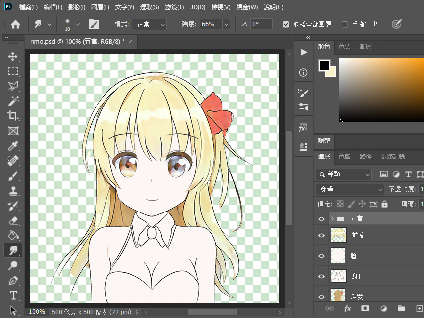
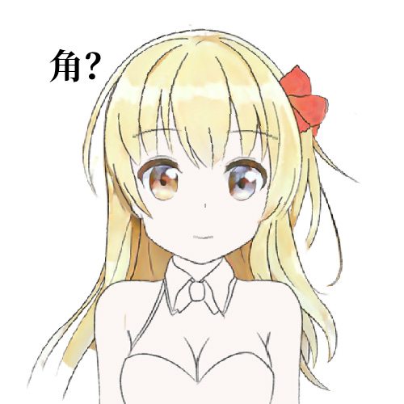
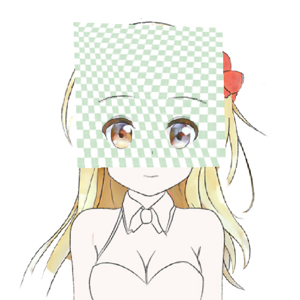

# 从零开始的自制Vtuber: 4.合成进化

章节的名字越来越奇怪了！  
怎么说呢，一要动手写教程，脑子里就会突然跳出来一些名字，心里想着「就是它了」，之后想要换个正规的名字又不舍得……

这个章节并不会让你把神经模式转移到Vtuber的身体里，我们只是要处理一些图形学的细枝末节，让Vtuber进化得更漂亮一些，以及顺便让Vtuber显示在你的桌面上。


## 警告

这个章节还没有完成校订，因此可能有和谐内容。

请您收好鸡儿，文明观球。


## 准备

在这个章节，你需要准备: 

+ 电脑
+ 上一节的代码
+ 更多的图形学知识
+ Python3
+ OpenGL


## 立绘进化

要让Vtuber好看，最根本的方法是把立绘画得好看一些。

所以我给莉沫酱涂了一些颜色。



<sub>(头发的旁边好像有个废图层漏出来了……)</sub>

如果你没办法画得好看，可能是色图看得少了，平时一定要多看萝莉图片！

此外，图层的拆分和合适的深度数值也是让运动自然的要点。比如莉沫酱的立绘里前发和后发都可以拆成几个更细的小图层，但是我没力气了所以以后再搞吧……

## 深度渐变

前几节的莉沫酱虽然会摇头摆尾(?)，但是动作还是很有纸片感——上色之后这个感觉会更明显。

出现这个问题，一个很重要的原因就是每个图层的深度都是确定的，因此角色看起来像是立体绘本，呃，就是机关书，你们小时候应该都见过这玩意吧？

总之我们先把图层改成四个顶点可以使用不同深度的吧，做了这个操作以后Vtuber就会比较逼真了。  
当然你不嫌麻烦的话也可以用类似的方法自己整一个深度网格或者深度贴图。

先把读取深度信息的数据类型改掉: 

```python
if type(z) in [int, float]:
    图层信息['深度'] = [z, z, z, z]
elif isinstance(z, list):
    图层信息['深度'] = z
else:
    raise Exception('???')
```

然后在给OpenGL指定时使用不同的深度就行了——

```python
z1,z2,z3,z4 = 图层数据['深度']
p1 = np.array([a, b, z1, 1])
p2 = np.array([a, d, z2, 1])
p3 = np.array([c, d, z3, 1])
p4 = np.array([c, b, z4, 1])
```

我们把莉沫酱的前发的上测的深度加大一点，就加0.1好了——



似乎有成效了，但是这个头发是不是怪怪的？好像有一个尖尖角？

试着在头发后面贴上一层网格图片，可以看到空间好像被扭曲了！   
<sub>(为了看起来更明显我又偷偷加大了深度)</sub>



其实我们的空间变换并没有出问题，你可以验证一下无论变换前后四个顶点都在同一个平面上。  
真正被扭曲的是那张贴图。

这是因为我们的图层不是矩形而是梯形。  
你可能会觉得奇怪「明明就是矩形啊」，但问题出在我们在第二节做了一个骚操作——

> 所以我们先做一个还原操作，把远处的图层放大，越远放得越大，这样一来图层乘上透视矩阵以后就会变成和原来一样大。  
> a[0] *= a[2]  
> a[1] *= a[2]  
> a = a @ matrix.perspective(999)  

这么一搞以后如果上面的边的深度更大，四个顶点乘上不同的放大倍数，矩形就成了梯形！而矩形的纹理在贴上梯形之前会先被三角剖分，梯形贴上两个三角形变成了不对称的，于是它们就错位了。

解决办法是使用`glTexCoord4f`和4维纹理座标——

```
p1 = np.array([a, b, z1, 1,  0, 0, 0, z1])
p2 = np.array([a, d, z2, 1,  z2, 0, 0, z2])
p3 = np.array([c, d, z3, 1,  z3, z3, 0, z3])
p4 = np.array([c, b, z4, 1,  0, z4, 0, z4])
```

前4个数是空间座标，后4个数是纹理座标，纹理座标的最后一维相当于空间座标的`w`维度。  
它的原理并不太复杂，不过这个部分好像已经太长了，所以我相信你看到`w`维度就已经猜到它的原理了。

做了这个修理之后你可以用网格图再测试一下它的扭曲是不是消失了，然后我们重新渲染——


角没有了！

这样一来，带有倾斜图层的莉沫酱终于渲染好了。


## 优化纹理

之前我们还提到过一个画面看上去有点模糊的问题。这是因为OpenGL要求纹理是正方形，而且边长是2的整数次幂，而当时我们为了图省事把所有的纹理都缩放到了`512px*512px`。

就是这个地方——

```python
纹理 = cv2.resize(图层数据['npdata'], (512, 512))
```

这回我们不在这里用缩放了，而是生成一个比原图层大一点的纹理，然后把原图层丢进去，这样就可以避免一次缩放。

```python
def 生成纹理(img):
    w, h = img.shape[:2]
    d = 2**int(max(math.log2(w), math.log2(h))+1)
    纹理 = np.zeros([d,d,4], dtype=img.dtype)
    纹理[:w,:h] = img
    return 纹理, (w/d, h/d)
```

额外返回的是座标，把它们在设置纹理座标的时候乘上对应的z就行了。

还有我们之前忘了给纹理设置Mipmap，这回一起把它加上。

```
glTexParameteri(GL_TEXTURE_2D, GL_TEXTURE_MIN_FILTER, GL_LINEAR_MIPMAP_LINEAR)
```


升级之后莉沫酱看起来更清晰了。


## 融合之门

现在差不多是时候让莉沫酱像真正的Vtuber一样在桌面上动了！  
(怎么听起来有点色情……)

总之我们要把OpenGL的底色设为透明，然后给窗口设置一些透明啊、悬浮在最上层啊之类的标记，最后放到屏幕的右下角就行了。

```python
Vtuber大小 = 500, 500
glfw.init()
glfw.window_hint(glfw.RESIZABLE, False)
glfw.window_hint(glfw.DECORATED, False)
glfw.window_hint(glfw.TRANSPARENT_FRAMEBUFFER, True)
glfw.window_hint(glfw.FLOATING, True)
window = glfw.create_window(*Vtuber大小, 'Vtuber', None, None)
glfw.make_context_current(window)
monitor_size = glfw.get_video_mode(glfw.get_primary_monitor()).size
glfw.set_window_pos(window, monitor_size.width - Vtuber大小[0], monitor_size.height - Vtuber大小[1])
```

以及`glClearColor(0, 0, 0, 0)`。


你可以自己去看库的文档，或者直接复制我的代码也行。


把Vtuber放到桌面上以后录个屏就可以直播了。

> 莉沫酱，你把代码挡住了。  
> 啊，对不起。  
> 看我找个借口把你推倒！  
> 不，不要过来！  


## 结束

如果我的某些操作让你非常迷惑，你也可以去这个项目的GitHub仓库查看源代码。

最后祝各位妻妾成群。

下一节: 
+ 我先休息两天再写
