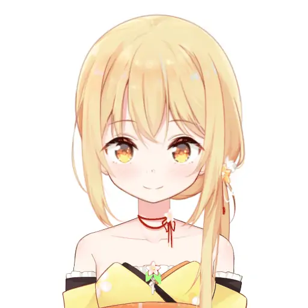
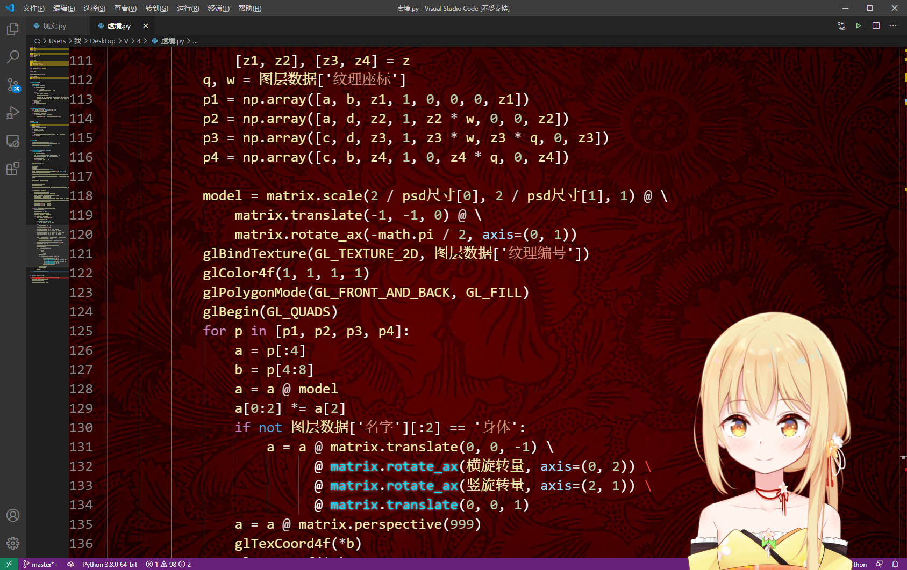
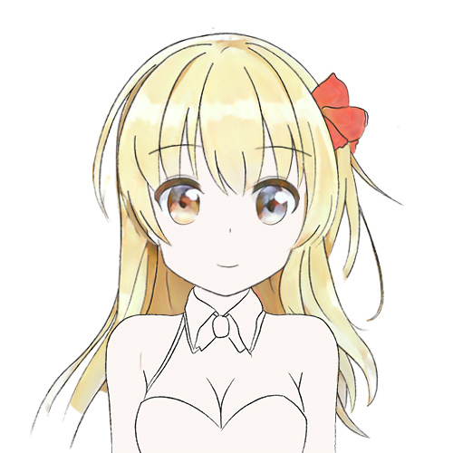
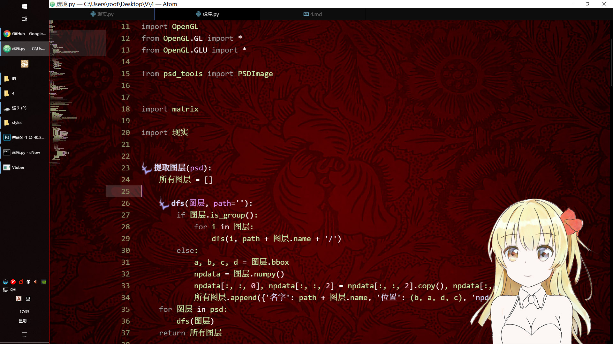
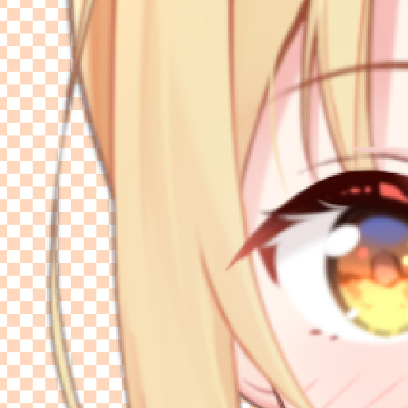

# 从零开始的自制Vtuber: 4.合成进化

这一节之所以叫「合成进化」是因为……怎么说呢，一要动手写教程，脑子里就会突然跳出来一些名字，心里想着「就是它了」，之后想要换个正规的名字又不舍得……

这个章节并不会让你把神经模式转移到Vtuber的身体里——在上一节里，我们已经做出了可以左摇右晃的立绘，现在是时候把脸部捕捉和动态立绘结合了。

此外，我们还要处理一些细枝末节，让Vtuber进化得更漂亮一些，以及顺便让Vtuber显示在你的桌面上。

## 警告

这个章节还没有完成校订，因此可能有和谐内容。

请您收好鸡儿，文明观球。


## 准备

在这个章节，你需要准备: 

+ 电脑
+ 前面两节的代码
+ 简单的线程知识
+ Python3
+ NumPy
+ OpenGL


## 分离线程

之所以要这么做是因为面部捕捉的帧率和绘图的帧率并不相同，因此它们不能同步。

拆分出线程也方便我们做其他的修改。

首先我们把面部捕捉和Vtuber绘图拆为两个文件，随便起名叫`现实`和`虚境`好了。

接下来把面部捕捉循环提取到函数里，然后用一个副线程来运行它。  
因为从直觉来看没有数据错误的问题，所以这里我们不用加锁。

```python
特征组 = [0, 0]
def 捕捉循环():
    global 原点特征组
    global 特征组
    原点特征组 = 提取图片特征(cv2.imread('../res/std_face.jpg'))
    特征组 = 原点特征组 - 原点特征组
    cap = cv2.VideoCapture(0)
    while True:
        ret, img = cap.read()
        新特征组 = 提取图片特征(img)
        if 新特征组 is not None:
            特征组 = 新特征组 - 原点特征组
        time.sleep(1 / 60)
t = threading.Thread(target=捕捉循环)
t.setDaemon(True)
t.start()
```

我留了一个全局变量和一个接口以便通信。

在绘图代码里，每次绘图之前调用`现实.获取特征组()`获取各个角度，就可以绘图了。


## 添加缓冲

这个缓冲不是电脑的缓冲而是真的缓冲……

也许你已经发现了，我们进行了多线程改造以后绘图画面还是很卡，它甚至更卡了。  

这是因为我们的绘图信息完全取决于面部捕捉，如果它不回报新的信息，下一帧画出的图就和上一帧是完全一样的。

因此，我们对特征做一个缓冲，让它像是SAI和Photoshop里的平滑画笔一样有一个逐渐改变的过程。  
当Vtuber的头要转到某个位置时，我们并不让头直接过去，而是让我们原本的旋转量快速趋向目标的旋转量。

此外，每一次人脸识别出的特征都或多或少含有一些噪声，这会让莉沫酱有一些不自然的抖动。缓冲操作对消除抖动也有很大帮助。

```python
def 特征缓冲():
    global 缓冲特征
    缓冲比例 = 0.8
    新特征 = 现实.获取特征组()
    缓冲特征 = 缓冲特征 * 缓冲比例 + 新特征 * (1 - 缓冲比例)
    return 缓冲特征
```

这样一来，画面立刻变得流畅了不少。

以前物述有栖就有很明显的这个问题，看来他们的程序员不像我这么聪明。

现在，我们可以把自己的脸的`横旋转量`和`竖旋转量`绑定到莉沫酱的图层上了——

```python
横旋转量, 竖旋转量 = 特征缓冲()
```

```python
a = a @ matrix.translate(0, 0, -1) \
      @ matrix.rotate_ax(横旋转量, axis=(0, 2)) \
      @ matrix.rotate_ax(竖旋转量, axis=(2, 1)) \
      @ matrix.translate(0, 0, 1)
```

然后，你可以试着在摄像机前左顾右盼，莉沫酱动起来应该会像是这样——

  

稳定而且流畅！  


## 融合之门

现在差不多是时候让莉沫酱像真正的Vtuber一样在桌面上动了！  
<sub>(怎么听起来有点色情……)</sub>

总之我们要把OpenGL的底色设为透明，然后给窗口设置一些透明啊、悬浮在最上层啊之类的标记，最后放到屏幕的右下角就行了。

```python
Vtuber大小 = 500, 500
glfw.init()
glfw.window_hint(glfw.RESIZABLE, False)
glfw.window_hint(glfw.DECORATED, False)
glfw.window_hint(glfw.TRANSPARENT_FRAMEBUFFER, True)
glfw.window_hint(glfw.FLOATING, True)
window = glfw.create_window(*Vtuber大小, 'Vtuber', None, None)
glfw.make_context_current(window)
monitor_size = glfw.get_video_mode(glfw.get_primary_monitor()).size
glfw.set_window_pos(window, monitor_size.width - Vtuber大小[0], monitor_size.height - Vtuber大小[1])
```

以及`glClearColor(0, 0, 0, 0)`。

你可以自己去看库的文档，或者直接复制我的代码也行。



莉沫酱真是太棒了！  
还有以后录个屏就可以直播了！

## 复仇

其实到这里并没有好，现在莉沫酱看起来是正常的，但如果把她放在白色背景下——



咦？莉沫酱在发光？？？

可以猜测，这应该是一个透明度的问题。我们把此时的渲染画面截图，送进Photoshop看看。  
<sub>(如果你不知道怎么给opengl截图，可以看看utils中的截图代码)</sub>



果然各种不该透的地方都透过去了！

这是因为我们在第二章中将透明度混合设置为了`glBlendFunc(GL_SRC_ALPHA, GL_ONE_MINUS_SRC_ALPHA)`——你在互联网上查OpenGL如何透明叠加，得到的主要都是这个答案，但它用在这个场景下其实是错的。

这句话的意思是，假如我要把像素`a: vector<4>`叠加在像素`b: vector<4>`上，最终得到的是——

```
c = a*a[3] + b*(1-a[3])
```

举个例子，当`a = [1, 1, 1, 0.5]`和`b = [1, 1, 1, 1]`

```
c = a*0.5 + b*0.5 
c = [1, 1, 1, 0.75]
```

等等，`c`的透明度怎么会是0.75，这「半透明+不透明=半透明」是什么情况？

实际上，在许多OpenGL应用中，它们只关注颜色通道。这些渲染的结果不会被用于二次渲染，而最终输出时的alpha通道又被丢弃了，所以那些时候它的最终效果看起来是对的。

正确的做法应当是为透明度和颜色指定不同的混合方式，像这样——

```
glBlendFuncSeparate(GL_SRC_ALPHA, GL_ONE_MINUS_SRC_ALPHA,GL_ONE, GL_ONE_MINUS_SRC_ALPHA)
```

修改了混合函数之后，我们重新渲染一次莉沫酱，再截图看看——



奇怪的透过没有了，真好！


## 结束

如果我的某些操作让你非常迷惑，你也可以去这个项目的GitHub仓库查看源代码。

最后祝各位妻妾成群。

下一节: 
+ [从零开始的自制Vtuber: 5.一时休战](5.md)

