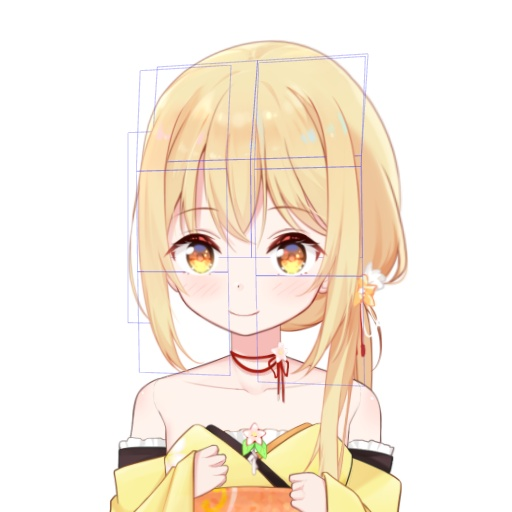
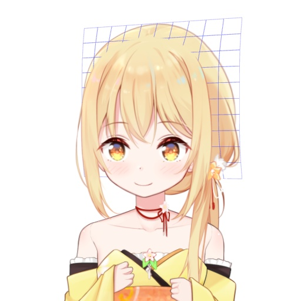

# 从零开始的自制Vtuber: 5.一时休战

这个章节的名字看起来就是要放鸽子……其实不是，现在我们要休息一下，这节写点让人放松的代码。

在这个章节里，我们要整理一下以前的代码，顺便拓展一下深度功能，让Vtuber变得更加真实。


## 警告

这个章节还没有完成校订，因此可能有和谐内容。

请您收好鸡儿，文明观球。


## 准备

在这个章节，你需要准备: 

+ 电脑
+ 前面两节的代码
+ Python3
+ NumPy
+ OpenGL


## 整理代码

之前几个章节的功能都是从零开始一点点加进来的，经过了许多章节的堆砌后，它们变得有些混乱。

因此我们得重新整理一下代码，首先，我想把图层的相关的功能抽出来做成类，让它负责图层内容的管理。

```python
class 图层类:
    def __init__(self, 名字, bbox, z, npdata):
        ...
    def 生成opengl纹理(self):
        ...
    def 导出(self):
        ...
```

`深度.yaml`被重新命名为了`信息.yaml`，这样每个图层包含的信息除了深度以外还可以有一些别的东西……究竟是什么呢？我们留到下一节再说吧。

接下来，我又新建了vtuber类。

```python
class vtuber:
    def __init__(self, psd路径, yaml路径='信息.yaml'):
        ...
    def opengl绘图循环(self, ...):
        ...
```

原本的函数`添加深度信息`和`提取图层`被合并，作为vtuber的`__init__`。  

`opengl绘图循环`现在是vtuber的方法了。

我也把`opengl绘图循环`中绘制图层的函数提取了出来，做成局部函数`draw`。它一次输入一个图层，然后把这个图层的顶点全部在窗口上画完。  
此外，我也为绘图循环添加了一点计时代码。

此外，从这一节开始，样例所用的莉沫酱立绘psd要更换成`莉沫酱较简单版.psd`了。这个文件的图层分得更细一些，可以支援一些更高级的操作。


## 图层切分

接下来，我们要对图层类进行改造。原本一个图层就对应OpenGL中的一个GL_QUADS，只能是一个平面，我们要让它变成多个GL_QUADS，从而达到模拟曲面的效果。

我们原本支持的深度格式包括一个数字，或者一个2×2的矩阵。现在，我们把它泛化到任意n×m的矩阵。

举个例子: 

```yaml
侧马尾: 
    深度: 
        - [0.8, 0.8]
        - [0.65, 0.65]
        - [0.7, 0.7]
```

我们希望在这样设置的时候，图层从上到下的深度是「后-前-略后」，像是一个向前弯曲的曲面。

为了达到这个效果，我们要通过四个顶点的座标，算出中间n×m-4个点的座标。

这很容易，只要稍微用上一点向量乘法的性质——

```python
x, y = self.shape
self.顶点组 = np.zeros(shape=[x, y, 8])
for i in range(x):
    for j in range(y):
        self.顶点组[i, j] = p1 + (p4-p1)*i/(x-1) + (p2-p1)*j/(y-1)
        self.顶点组[i, j, 2] = 深度[i, j]
```

需要注意的是，尽管我们定义了四个点，但这个算法只用到了`p1`、`p2`、`p3`，并没有用到`p3`。这是因为我们假设四个点是在同一个平面上<sub>(OpenGL也是这么假设的)</sub>，如果这个四面体有明显的体积，渲染出来的结果可能会有些不对劲。

绘图的时候，绘制的就不是原本的顶点组，而是把(n-1)×(m-1)个GL_QUADS统统绘制一遍。

```python
for i in range(x-1):
    for j in range(y-1):
        绘制方块(
            [[源[i, j], 源[i, j+1]],
             [源[i+1, j], 源[i+1, j+1]]]
        )
```

绘图的效果是这样——


不过这个时候我们不太容易看出效果。  
为了看清楚，我们可以把前发挑出来，把第二节里用过的线框绘图模式再叠加一层上去。



看起来很成功！

顺便说一下后发的深度问题——后发类似一个鼓起来的球面，而不是凹进去的，也就是后发中心反而更靠近观众。  
这似乎和直觉相反，但你可以想象一下无论我们从哪个面观察人头，看到的一定是凸的那一面。

深度网格看起来应该像是这样——



不过也许你会觉得奇怪，我们的面都是长方形，要怎么做出一个漂亮的曲面呢？  
有一个简单的方法是另外写一段代码，用函数来生成深度的`np.array`，然后再把它粘贴回yaml里。

<sub>(其实是我懒得再把用函数生成的功能加进来2333)</sub>


## 多线程

我一开始以为用Dlib提取特征不会占用GIL……但是也不知道是GIL改了还是我想的不对，现在程序无法使用多个CPU核心。

总之我们现在必须把特征提取从多线程改成多进程。

大概把`捕捉循环`放到副进程里就行了。

像是这样——

```python
pipe = multiprocessing.Pipe()
def 启动():
    p = multiprocessing.Process(target=捕捉循环, args=(pipe[0],))
    p.daemon = True
    p.start()
```

其实我也没怎么写过多进程所以不要问我，上一次写多进程还是2017年的时候，能跑就行了，不能跑的话就去抄代码吧……


## 加速！

当我们分割出较多的面之后，如果你的电脑的配置不好的话，应该差不多要感到卡顿了。

「接下来我们把旧式的OpenGL API换成VBO」——也许这个时候你会以为接下来的内容是这个，但其实不是。

实际上，在渲染循环中，真正慢的是我们多次调用Numpy进行的矩阵乘法。  
其实它们本来应该写成GLSL，但是在这个教程我想的是降低OpenGL的存在感，仅仅把它当作绘图工具，而更多从向量的基础方式来解释这些事情。这样一来一方面省得读者再去多学一门语言，另一方面Numpy调试起来也比GLSL简单快捷许多。

但是我们还是有办法优化矩阵乘法的！

仔细观察一下我们的写法——

```python
for p in [p1, p2, p3, p4]:
    位置 = p[:4] @ model
```

model矩阵是放在循环里面乘的？  

如果我们预先把`[p1, p2, p3, p4]`叠在一起，变成一个4×8的矩阵，然后再乘model，只要做一次大的矩阵乘法就行了。  
甚至我们把一个图层的所有顶点全部合并成为一个n×8的矩阵，再乘model，这样岂不是只要调用O(n)次矩乘就行了！

```python
    源 = 图层.顶点组导出()
    x, y, _ = 源.shape
    所有顶点 = 源.reshape(x*y, 8)
        
    a, b = 所有顶点[:, :4], 所有顶点[:, 4:]
    a = a @ model
    ...
```

最后绘图的时候再把它们组合回来——

```python
所有顶点[:, :4], 所有顶点[:, 4:] = a, b
所有顶点 = 所有顶点.reshape([x, y, 8])
for i in range(x-1):
    for j in range(y-1):
        for p in [所有顶点[i, j], 所有顶点[i, j+1], 所有顶点[i+1, j+1], 所有顶点[i+1, j]]:
            glTexCoord4f(*p[4:])
            glVertex4f(*p[:4])
```

<sub>(结果最后还是没用上VBO)</sub>

经过修改之后，帧率可以提高到原本的数倍，这样就不会卡住了。


## 结束

如果我的某些操作让你非常迷惑，你也可以去这个项目的GitHub仓库查看源代码。

最后祝各位萝莉缠身。


下一节: 
+ [从零开始的自制Vtuber: 6.与神之假身的接触](6.md)
