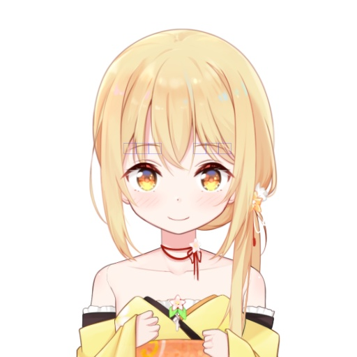
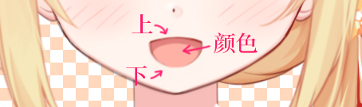
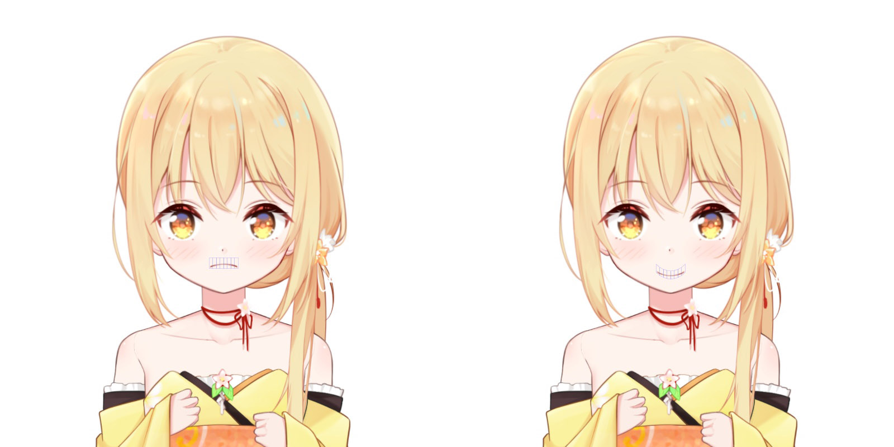

# 从零开始的自制Vtuber: 6.与神之假身的接触

本来章节的名字又要放飞自我，叫什么「与神之假身的接触」之类的，还好我刹车踩住了。

对不起最后还是没踩住2333

在第六节里，我们要为莉沫酱添加一些不同的表情。


## 警告

这个章节还是草稿，它会在之后的commit中加入和谐内容，请您不要收好鸡儿，不要文明观球。


## 准备

在这个章节，你需要准备: 

+ 更好的电脑
+ 前面所有的代码
+ 全靠蒙的知识
+ Python3
+ NumPy
+ OpenGL


## 五官变形

在之前的章节里，莉沫酱的五官位置都是固定的，现在我们来让她做一些不同的表情！

我们先来做一些简单的事情，把眉毛弯下来一点，做成一个嘲讽(?)的形态

首先，我们用上一节定义深度网格的方法把眉毛分割成三格——

```yaml
深度:
    - [0.65, 0.65, 0.65, 0.65]
    - [0.65, 0.65, 0.65, 0.65]
```

现在如果把网格绘制出来，看起来应该是这样——



接下来，我们要让莉沫酱做出讽刺的表情。

可以简单地用一个`变形.yaml`来表示变形信息，以这样的形式定义一个变形——

```yaml
讽刺: 
    头/五官/眉毛/左:
        位置:
            - [[0, 0.01], [0, -0.01], [0, -0.02], [0, -0.02]]
            - [[0, 0.01], [0, -0.01], [0, -0.02], [0, -0.02]]
```

这个矩阵中的每个`(dx, dy)`即表示莉沫酱的左眉偏移的座标。

我们在绘图时把它加在对应的图层(眉毛)上——

```python
if '位置' in 变形[图层名]:
    d = np.array(变形[图层名]['位置'])
    a[:, :2] += d.reshape(a.shape[0], 2)
```


眉毛弯啦！(另一边的我自己也偷偷加上了)

它看起来稍微有点抖抖的，这是因为现在只分了三段，你可以适当地多分一点让它看起来更加自然。


接下来我们来给嘴巴也做上开合的效果——

一般来说，嘴是由三个图层构成的，包括`上`、`下`、`颜色`，像是这样——



<sub>其实我自己也没想到，但是画师酱很有经验，他似乎按照某些习惯上的标准给我这么画了所以做起来就很轻松。</sub>

我们以普通的微笑状态为基准，对上下嘴唇分别添加变形，让它们重合到一起。

以上嘴唇为例，先把其他的图层隐藏起来，像是这样——



也许这里不太容易把这些点调到想要的位置上，你可以用和上一章类似的写函数的方法来解决它。

然后，我们把下嘴唇也调到这个重合的位置之后，就可以来测试张嘴-闭嘴的效果了。

我们用一个`cos`函数来循环地控制这个变形的强度，也就是——

```python
a[:, :2] += d.reshape(a.shape[0], 2) * (math.cos(time.time()*k)+1)/2 
```

渲染出来看看——


太棒了，看起来就像是莉沫酱真的在说话一样！

<sub>(对了，别忘了把颜色图层的变形也补上)</sub>


## 绑定

接下来我们要让莉沫酱的表情和自己的表情同步。


