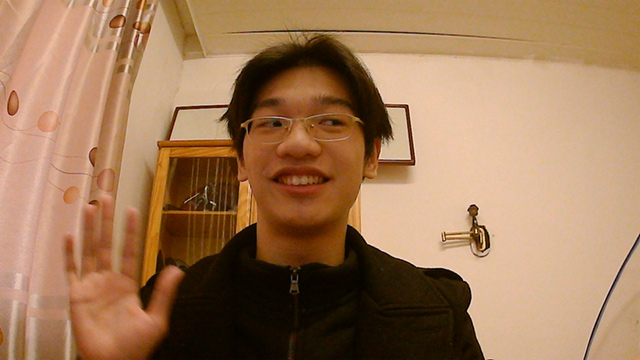
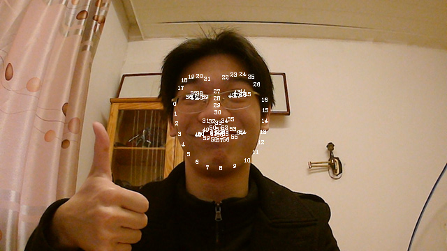
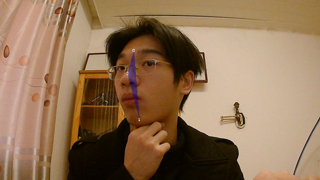
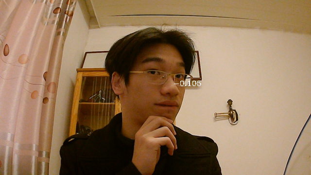
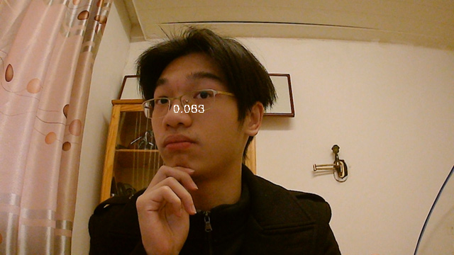

# 从零开始的自制Vtuber: 1.面部捕捉初级

这是一个自制Vtuber的教程，这个教程包含从面部捕捉到图形渲染的一条龙服务。

这个教程是迭代式的，因此每当你看完一章时都可以做出一个Vtuber，它会随着你的学习而越发强大。

也许你能从中学到很多知识，但请不要跟着这个教程做，因为我有一些操作过于神奇以至于成了反面教材。

在第一节里，我们将会简单地体验一下面部捕捉技术，然后用一些数学计算追踪头部的角度，最后用一个简单的角色来展示今天的成果。

## 警告

这个章节还没有完成校订，因此可能有和谐内容。

请您收好鸡儿，文明观球。

## 准备

在这个章节，你需要准备: 

+ 电脑
+ 摄像头
+ 基本的图形图像概念
+ 高中的计算几何知识
+ Python3
+ Dlib
+ OpenCV
+ NumPy 

明明是从零开始却用了好多库！

事情是这样的，根据皮亚诺公理，凡是你认为是0的东西就是0。

## 读取视频流

首先我们使用OpenCV从摄像头读取视频流，并尝试着把它播放在窗口上。

```python
cap = cv2.VideoCapture(0)
while True:
    ret, img = cap.read()
    img = cv2.flip(img, 1)
    cv2.imshow('self', img)
```

`cv2.flip`的作用是把帧左右翻转，使你看起来像在照镜子一样。



完成之后，你应当会获得一个这样的窗口。  
如果你的窗口里的人和长得和上面的不一样，这是正常的。

## 提取面部关键点

接下来我们将使用Dlib提取面部关键点。因为Dlib挺好用的，所以我们暂时不用去想它是怎么做到的。

在这之前，我们得先确保`img`中至少有一张人脸，并找到最大的那张脸。

之所以要这么做并不是为了防止萝〇在旁边捣乱<sub>(她的脸比较小)</sub>，而是防止有时把环境里某些看起来像人头的小物件识别成脸而引起面部捕捉的错误。

```python
detector = dlib.get_frontal_face_detector()
def 人脸定位(img):
    dets = detector(img, 0)
    if not dets:
        return None
    return max(dets, key=lambda det: (det.right() - det.left()) * (det.bottom() - det.top()))
```

接下来，我们就可以对刚才找到的脸位置提取关键点了。为了让接下来的向量运算方便一些，你可以考虑把他们通通转换成`np.array`。

如果你没有`shape_predictor_68_face_landmarks.dat`，可以去[这里](https://github.com/AKSHAYUBHAT/TensorFace/blob/master/openface/models/dlib/shape_predictor_68_face_landmarks.dat)下载。

```python
predictor = dlib.shape_predictor('shape_predictor_68_face_landmarks.dat')
def 提取关键点(img, 脸位置):
    landmark_shape = predictor(img, 脸位置)
    关键点 = []
    for i in range(68):
        pos = landmark_shape.part(i)
        关键点.append(np.array([pos.x, pos.y], dtype=np.float32))
    return 关键点
```

接下来试着把这些关键点在你的摄像头画面上绘制出来——

```python
for i, (px, py) in enumerate(关键点):
    cv2.putText(img, str(i), (int(px),int(py)), cv2.FONT_HERSHEY_COMPLEX, 0.25, (255, 255, 255))
```



如果一切正确的话，你的窗口将会像上面这样，有种戴上了奇怪的面具的感觉。

## 计算面部特征

第一天我们先来试着提取一点简单的特征吧，就做「头的左右旋转」好了。

这个原理非常简单以至于我们可以用手来实现它。  
我们知道，越远离旋转轴的点，受到旋转的影响就越大，也就是说，我把头向左转的时候，尽管我的眉毛和鼻子都向左移动了，但是鼻子一定在比眉毛还左的左边。

接下来我们根据关键点计算一下它们的座标，就可以计算出旋转角度了。

```python
def 生成构造点(关键点):
    左眉 = [19, 20, 21]
    右眉 = [22, 23, 24]
    下巴 = [6, 7, 8, 9, 10]
    鼻子 = [29, 30]

    眉中心 = sum([关键点[i] for i in 左眉 + 右眉]) / 6
    下巴中心 = sum([关键点[i] for i in 下巴]) / 5
    鼻子中心 = sum([关键点[i] for i in 鼻子]) / 2

    return 眉中心, 下巴中心, 鼻子中心
```

你可以模仿上面画关键点的代码在图上把它们画出来，它们应该长这样——



可以看出`眉中心` `下巴中心` `鼻子中心`组成了一个三角形。这个三角形越是瘦长，脸部就越是中正。因此你只要用一点向量知识来计算它的胖瘦就可以得到脸部的旋转量。

任意两条边做叉乘就能得到三角形的有向面积，除以底边长就能得到对应底边上的有向高，再除一次底边得到的就是高与底的比值了。

```python
def 生成特征(构造点):
    眉中心, 下巴中心, 鼻子中心 = 构造点
    中线 = 眉中心 - 下巴中心
    斜边 = 眉中心 - 鼻子中心
    旋转量 = np.cross(中线, 斜边) / np.linalg.norm(中线)**2
    return 旋转量
```

把旋转量画在鼻子上，它看起来是这样——




如果你用起来的效果很差，说明你的鼻子太扁了，你可以考虑整容来解决这个问题。

## 绘图

现在我们马上就要做出第一个会动的Vtuber了，因为画画很麻烦所以先用圆圈凑合一下。

只要画上几个圈圈，让它们的座标取决于脸部的旋转量，这张圆圈脸看起来就好像跟着人脸在旋转一样——

```
def 画图(旋转量):
    img = np.ones([512, 512], dtype=np.float32)
    脸长 = 200
    中心 = 256, 256
    左眼 = int(220 - 旋转量 * 脸长), 249
    右眼 = int(292 - 旋转量 * 脸长), 249
    嘴 = int(256 - 旋转量 * 脸长 * 0.5), 310
    cv2.circle(img, 中心, 100, 0, 1)
    cv2.circle(img, 左眼, 15, 0, 1)
    cv2.circle(img, 右眼, 15, 0, 1)
    cv2.circle(img, 嘴, 5, 0, 1)
    return img
```


这一章就到此为止了……这东西真的能叫Vtuber吗<sub>(笑)</sub>。

这样吧，下一章里我会先来画一张立绘，好做出一个可爱的Vtuber。
